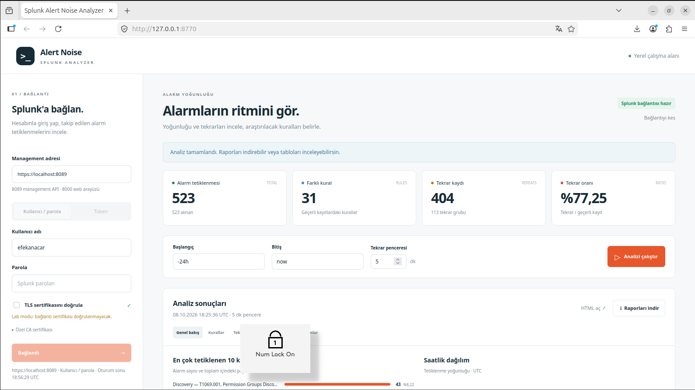

# Splunk Alert Noise Analyzer

Splunk'ta takip edilen alarm tetiklenmelerinin yoğunluğunu ve kısa aralıklarla tekrarını inceleyen küçük bir araç. Kural adı, zaman ve bunlardan hesaplanan ölçümleri gösterir.



## Ubuntu'da başlat

ZIP'i çıkarın. app.py ve start.sh dosyalarının bulunduğu klasörde terminal açın:

```bash
sudo apt update
sudo apt install -y python3 python3-venv
bash start.sh --port 8766 --no-open
```

**Ubuntu içindeki tarayıcıda http://127.0.0.1:8766 açın.** Terminal açık kalmalıdır; durdurmak için Ctrl+C. Python 3.10+ gerekir. Başlatıcı sanal ortamı ve bağımlılıkları ilk çalıştırmada kurar.

Port doluysa `bash start.sh --port 8770 --no-open` kullanıp http://127.0.0.1:8770 açın. Varsayılan port 8765'tir; `--no-open` portu değiştirmez. `dotenv` hatası alırsanız sanal ortamın dışındaki Python'u çalıştırmış olabilirsiniz. `bash start.sh` ile başlatın.

Normal Ubuntu hesabınızla çalıştırın. ZIP'i root olarak çıkardıysanız yalnızca proje klasörünün sahipliğini kendi hesabınıza düzeltip normal kullanıcıya dönün.

Arayüz yalnızca 127.0.0.1 üzerinde dinler. Windows'taki localhost adresi Ubuntu VM'yi göstermez. Uzak tarayıcı için SSH tüneli kullanabilirsiniz:

```bash
ssh -L 8766:127.0.0.1:8766 UBUNTU_KULLANICISI@UBUNTU_IP
```

## Bağlan ve analiz et

1. Splunk aynı Ubuntu'daysa management adresi `https://localhost:8089` olur. Uzak makine örneği: `https://192.168.3.131:8089`. Erişilebilir olduğu varsayılmaz. **8000, Splunk Web portudur; API için kullanılmaz.**
2. **Kullanıcı / parola** veya **Token** yöntemlerinden birini seçin ve bilgilerinizi girin.
3. TLS doğrulaması varsayılan açıktır. Gerekirse **Özel CA sertifikası** alanına Ubuntu'daki CA dosya yolunu yazın. Sertifika adı adresle uyuşmalıdır. Yalnızca lab için doğrulama kutusunu açıkça kaldırabilirsiniz.
4. **Bağlan** ile TCP, kimlik doğrulama ve tetiklenmeleri okuma erişimini doğrulayın.
5. Başlangıç, bitiş ve tekrar penceresini seçip **Analizi çalıştır** düğmesine basın.
6. **Raporları indir** ile CSV ve HTML raporlarını ZIP olarak alın.

Varsayılan son 24 saat (`-24h` / `now`) ve 5 dakika penceredir. Zaman alanları `-30m`, `-7d`, saat dilimli ISO 8601 veya epoch saniyesi kabul eder. Başlangıç dahil, bitiş hariçtir. Hesaplar UTC'dir; göreli sınırlar indirme başlamadan sabitlenir.

## Sonuçlar

- **Genel bakış:** toplam tetiklenme, farklı kural, tekrar sayısı/oranı, en yoğun 10 kural ve toplam payları, saatlik dağılım.
- **Kurallar:** tetiklenme sayısı, toplam pay, tekrar sayısı/oranı ve grup sayısı. Sütun başlıklarıyla sıralanabilir.
- **Tekrar grupları:** kural, başlangıç, son tetiklenme, kayıt sayısı ve tekrar sayısı.
- **Kayıtlar:** tetiklenme zamanı ve kural adı.
- **Atlananlar:** geçersiz/eksik zaman veya eksik kural nedeniyle atlanan kayıtlar ve nedenleri.

Host, olay kullanıcısı, severity, güven sütunları ve bunlara bağlı grafik/kalite kartları arayüz ve UI raporlarında bulunmaz. Mevcut kaynak bunlar için anlamlı olay verisi sağlamadığından boş yer tutucular gösterilmez.

Tablolar 25 satırlık sayfalara ayrılır. Her tablonun ilk 500 satırı arayüze yüklenir; arama ve kural filtresi bu satırlarda çalışır. Tam satır sayısı gösterilir ve tamamı CSV'dedir. Filtreler özet kartlarını değiştirmez. Saat grafiği ilk 500 dolu saati, dolu saat sırasıyla gösterir; sıfır saatler üretilmez.

## Tekrar hesabı

**Arayüzde tekrarlar kural bazındadır.** Kayıtlar zamana göre sıralanır. Aynı kural için ilk tetiklenmeden başlayan `[başlangıç, başlangıç + pencere)` grupları oluşturulur. Pencere kaymaz. Tam sınırdaki kayıt yeni grup başlatır. Her N kayıtlı grupta N-1 tekrar sayılır.

Örnek: aynı kuralın 10:00, 10:03, 10:05 ve 10:06 tetiklenmeleri; 5 dakika pencere → iki grup ve toplam iki tekrar.

Bu ölçüm, aynı kuralın kısa aralıklarla yeniden tetiklenmesini gösterir. **Kayıtların aynı olaya ait olduğunu veya false positive olduğunu kanıtlamaz.** Araç alarm değiştirmez, kapatmaz veya otomatik kural kapatma önerisi üretmez.

## Kapsam ve raporlar

Arayüz `/servicesNS/-/-/alerts/fired_alerts/-` üzerinden yalnızca GET ile görünür tetiklenmeleri okur. SPL veya gerçek index adı yazmanız gerekmez. Her kayıt bir tetiklenmedir; ham olay sayısı değildir. Yalnızca takip edilen, saklama süresi dolmamış ve hesabın görebildiği kayıtlar gelir. Boş sonuç, alarm olmadığı anlamına gelmez.

Koleksiyon sayfalanarak alınır; zaman filtresi yerelde uygulanır. Toplam, offset ve kayıt kimlikleri kontrol edilir. Eksik, yinelenen veya toplamı değişen sayfa hata verir; kısmi rapor oluşturulmaz. Varsayılan indirme timeout'u 120 saniye, tek istek timeout'u 15 saniye, üst sınır 100000 kayıttır. Canlı koleksiyon atomik snapshot garantisi taşımaz.

Her analiz `reports/ui/<analiz-id>/` klasörüne yazılır. Yedi CSV: summary, rules, hourly, candidates, repeats, alerts, rejected. Ayrıca dashboard.html, kapsam/zaman/gruplama bilgisini içeren run.json ve report.zip üretilir. UI ZIP'inde kaldırılan alanlar bulunmaz. Önceki raporlar ezilmez.

Rapor bağlantıları onları oluşturan aktif oturuma aittir. Çıkıştan sonra dosyalar yerel reports/ klasöründe kalır. İndirilen HTML çevrimdışı açılabilir; CSV bağlantıları için klasörü birlikte taşıyın. Eski raporlar kendi oluşturuldukları sürümün sütunlarını içerir.

## Oturum ve hatalar

Parola/token dosyaya, rapora, loga veya tarayıcı depolamasına yazılmaz. Başarılı girişte alanlar temizlenir; bilgiler sunucu belleğinde en fazla bir saat tutulur. Çıkışta veya uygulama kapanınca silinir. Tarayıcıya HttpOnly / SameSite=Strict oturum çerezi verilir. Yenileme oturumu korur; sonuçları görmek için analizi tekrar çalıştırın.

- **TCP:** `/opt/splunk/bin/splunk status`, management adresi ve portunu kontrol edin.
- **TLS:** CA dosyası ve sertifika adını kontrol edin.
- **401:** kullanıcı/parola veya token doğrulanamadı.
- **403:** ilgili kayıtları okuma yetkisi yok.
- **Boş sonuç:** zaman aralığı, takip ayarı, saklama süresi ve yetkileri kontrol edin.
- **Oturum süresi doldu:** yeniden bağlanın.

## Dosyalar ve doğrulama

app.py: yerel sunucu/oturum ve sade raporlar; ui/: Türkçe HTML/CSS/JavaScript; start.sh: Ubuntu başlatıcı; analyzer.py: hesaplar; local_splunk.py: GET ile tetiklenme alma; dashboard.py: çevrimdışı HTML.

Önceki CLI dosyadan ve yapılandırılmış SPL'den analiz için korunmuştur. cli.py, input_files.py ve splunk_client.py bu akışı sağlar. .env.example ve config.json yalnızca CLI içindir; UI bu dosyalardan otomatik giriş yapmaz. CLI'nin dosya analizinde orijinal kural/host/kullanıcı gruplaması korunur; bu README'deki sade ekran kural bazında çalışır.

40 test geçti. Pencere sınırları, zaman sıralaması, kural bazında gruplama, boş sonuç, API sayfalama, giriş/çıkış ve rapor erişimi doğrulandı. Sade UI raporlarının kaldırılan alanları içermediği kontrol edildi. Tarayıcı doğrulaması sahte Splunk yanıtlarıyla yapıldı. Geliştirme ortamı Windows/Python 3.12'dir; Python 3.10 sözdizimi kontrol edildi. **Canlı Ubuntu/Splunk bağlantısı burada doğrulanmadı.**

Paylaşılan kaynak kodda ve ZIP'te gerçek parola/token veya SOC raporu bulunmaz. .gitignore; .env, yerel ortam dosyaları, .venv, önbellekler ve reports/ dizinini dışlar.
